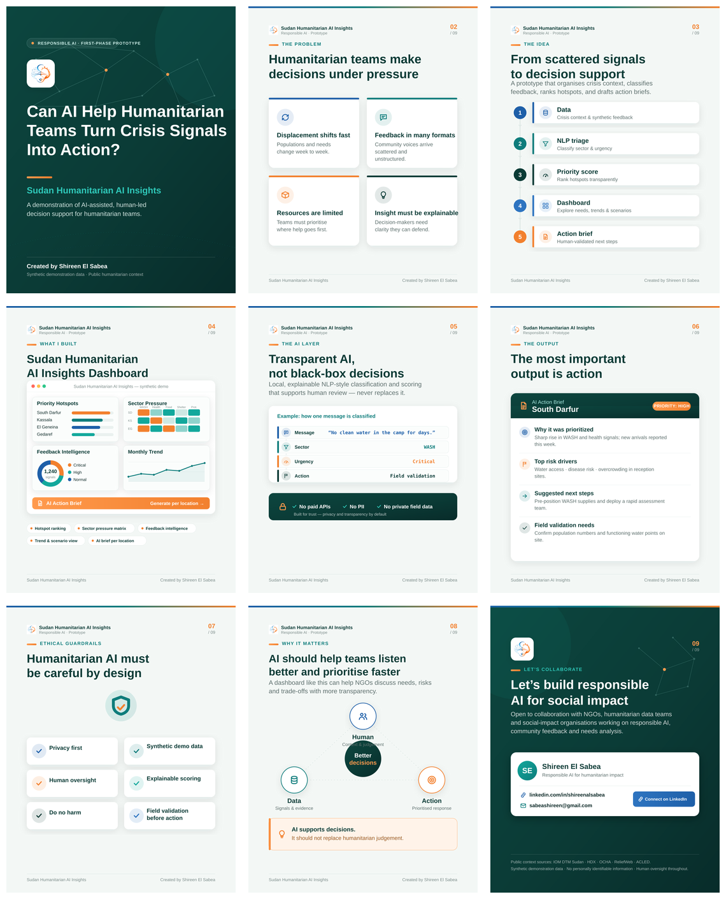

# Sudan Humanitarian AI Insights



A responsible AI portfolio project by **Shireen El Sabea**.

This repository contains a complete public case study for humanitarian needs analysis in Sudan:

- Interactive Streamlit dashboard
- Vercel-ready project hub
- LinkedIn carousel
- Technical PDF report
- Synthetic demo datasets
- Transparent methodology and ethical-use notes

The goal is to show how humanitarian teams could use structured data, community feedback triage, and transparent scoring to support better prioritization conversations without exposing private data.

## Creator

**Shireen El Sabea**

- GitHub: https://github.com/Shireenelsabea
- LinkedIn: https://www.linkedin.com/in/shireenalsabea/
- Email: sabeashireen@gmail.com

## Project Links

After deployment, add the final URLs here:

- Vercel project hub: `https://shireen-sudan-humanitarian-ai-insights.vercel.app`
- GitHub Pages project hub: `https://shireenelsabea.github.io/shireen-sudan-humanitarian-ai-insights/`
- Streamlit dashboard: `https://YOUR_STREAMLIT_APP.streamlit.app`
- GitHub repository: `https://github.com/Shireenelsabea/shireen-sudan-humanitarian-ai-insights`

## What The Project Demonstrates

The dashboard turns a synthetic humanitarian scenario into:

- State-level displacement and needs visuals
- Transparent priority scoring
- Rule-based feedback triage for sector and urgency
- A simple scenario extension for planning discussion
- Review queues for humanitarian teams
- Downloadable decision-support briefs
- Methodology notes and ethical guardrails

## Repository Structure

```text
app/
  app.py                         Streamlit dashboard

data/
  state_needs.csv                Synthetic state-level scenario data
  feedback_samples.csv           Synthetic community feedback samples
  monthly_trends.csv             Synthetic trend data

docs/
  index.html                     Vercel project hub
  assets/                        Logo, figures, carousel images
  downloads/                     Public report and carousel PDFs

reports/
  study_report.tex               Technical report source
  figures/                       Report visuals

linkedin-carousel/
  generate_carousel.py           Carousel generation script
  slides/                        Carousel slide images

requirements.txt                 Streamlit app dependencies
vercel.json                      Vercel static deployment config
DEPLOYMENT.md                    Deployment notes
FREE_DEPLOY_CHECKLIST.md         Short deployment checklist
```

## Run The Interactive Dashboard Locally

```powershell
pip install -r requirements.txt
streamlit run app/app.py
```

Open:

```text
http://localhost:8501
```

If port `8501` is already busy, Streamlit will suggest another local port.

## Deploy The Project Hub On Vercel

This repository includes a Vercel static configuration:

```json
{
  "framework": null,
  "buildCommand": null,
  "installCommand": "",
  "outputDirectory": "docs",
  "cleanUrls": true
}
```

Vercel should serve the complete project hub from:

```text
docs/index.html
```

Use these Vercel settings if asked:

- Framework preset: `Other`
- Build command: empty
- Install command: empty
- Output directory: `docs`

## Deploy The Interactive App For Free

Use Streamlit Community Cloud for the live interactive dashboard:

- Main file path: `app/app.py`
- Python version: `3.11` or `3.12`
- Secrets: none

Vercel hosts the project hub. Streamlit Community Cloud hosts the interactive Python dashboard.

## Deploy The Project Hub On GitHub Pages

This repository includes a GitHub Actions workflow:

```text
.github/workflows/pages.yml
```

After the repository is pushed to GitHub, open:

```text
Settings > Pages
```

Set the source to:

```text
GitHub Actions
```

The project hub will deploy to:

```text
https://shireenelsabea.github.io/shireen-sudan-humanitarian-ai-insights/
```

## Data Transparency

This is a public portfolio demonstration, not an operational deployment.

The included state-level values and feedback records are synthetic case-study data calibrated around public humanitarian reporting themes. No personal data is included.

Useful public context sources:

- IOM DTM Sudan Mobility Tracking: https://dtm.iom.int/sudan
- HDX Sudan IOM DTM dataset page: https://data.humdata.org/dataset/sdn-iom-dtm-from-api
- OCHA Sudan HDX organization page: https://data.humdata.org/organization/ocha-sudan
- ReliefWeb Sudan response updates: https://response.reliefweb.int/sudan

## Ethical Note

This project supports human decision-making. It should not replace field validation, protection protocols, or community accountability mechanisms.

The value of the prototype is not automated allocation. The value is clearer triage, better documentation, and a more structured conversation about humanitarian priorities.
